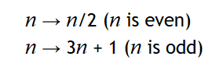

# Introduction to Java programming

## Control flow - Practice problems

### Conditional blocks

The first __control flow__ element that we have discussed is the __conditional block__. It is build from `if`, `else if` and `else` elements. Conditional blocks allow you to __selectively execute__ code and only run certain parts of your applications when certain conditions are fulfilled.

- __(True/False)__ Conditions are boolean expressions.
- __(True/False)__ `&&` is the only operator available to combine smaller expressions into bigger ones.
- __(Short answer)__ Describe how the following code fragment is executed depending on the different values of the variable `i` (assume that `i` is __declared__ and __initialized__ prior to the code below):

```java
if(i <= 10) {
	System.out.println("<= 10");
} else if(i <= 20) {
	System.out.println("<= 20");
} else if(i <= 30) {
	if(i == 25) {
		System.out.println("25!");
	} else {
		System.out.println("Better luck next time!");
	}
} else {
	System.out.println("None of the above.");
}
```

- __(Programming)__ Build a small program that will convert __numerical grades__ into __letter grades__ AND __grade-point average__ values. You should print the result of the conversion as a sentence in which data is embedded.
- __(Programming)__ Can you do the above without using `&&` or `||` in your conditions?
- __(Programming)__ In the previous problem set, you built a routine to convert Celsius to Fahrenheit. Can you use conditional statements to ensure that the Celsius value given to your routine is valid? Print an error message if it isn't.

### Scope

__Scope__ is the idea that variables "live" in certain areas of your code and can only be accessed in the block they were declared in and its children.

- __(True/False)__ Scope is just a suggestion, disregarding it will not crash a program.
- __(True/False)__ __Garbage collection__ is the process by which Java gathers the variables that are __out of scope__.
- __(Short answer)__ Can you explain what is a __parent__ element and what is its __children__ in the context of programming?

### Loops

__Loops__ are another way to alter your program's flow and will allow you to define blocks of code which are repeated.

- __(True/False)__ There exist __three__ kinds of loops: `while`, `for` and `do-while`.
- __(True/False)__ The condition of the `while` loop is only checked when entering the loop for the first time.
- __(True/False)__ Infinite loops are impossible in `for` loops.
- __(True/False)__ Loop conditions cannot use `&&` and `||`; they must be simple boolean expressions.
- __(True/False)__ `for` loop headers have __four__ segments: the counter initialization, the condition, the counter update and the operation executed when the program exits the loop.
- __(True/False)__ Any loop can be rewritten from `while` to `for` and vice-versa.
- __(Short answer)__ Can you explain the consequences of having an __infinite loop__ in your program?
- __(Short answer)__ Can you build a flowchart of what happens when a Java program executes a loop? Do so for both `while` and `for` loops.

For all the programming questions below, feel free to use `while` or `for` loops at your discretion unless otherwise specified. Moreover, make sure that you understand how you would write it with the kind of loop you didn't choose.

- __(Programming)__ Using loops, print statements and concatenation, try producing a small loop that will print out the following:

```java
*****
****
***
**
*
```

_Note: You should be generating the lines dynamically._

- __(Programming)__ Can you adjust your previous code so that the width of the first line is adjustable? Make it a variable called `width` that you can change. You should see the same pattern no matter the width of the first row.
- __(Programming)__ Write a program that will compute 100th Fibonacci number. [Read more about Fibonacci sequences here](https://www.mathsisfun.com/numbers/fibonacci-sequence.html).
- __(Programming)__ Write a program that will find the 100th prime number. [Read more about prime numbers here](https://www.mathsisfun.com/prime_numbers.html). (Conveniently, this page contains a list of prime numbers that you can use to validate your answers.)
- __(Programming)__ Generalize the previous program so that you can generate the Nth prime number.
- __(Programming)__ Write a program that will, given a seed integer N, print all the numbers part of the _Collatz sequence_ starting from N. If you have a current value `n` in your sequence, the next Collatz sequence value is defined by the following relationship:

