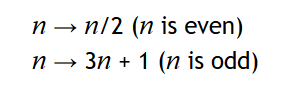

# Introduction to Python programming

# Control flow - Practice problems

Read the material associated with these problems [here]().

## 1. Conditional statements

- __(True/False)__ Both the `if` and `else` statements are mandatory in conditional structures.
- __(True/False)__ Boolean expressions can be chained into more complex conditions.
- __(True/False)__ The `xor` keyword can be used to test whether only one of two conditions is true.
- __(Short answer)__ Explain what happens when the following structure is read over by the interpreter. Make sure you understand which conditions are __evaluated__ depending on the value of the `value` variable.

```python
#Assume that `value` is a variable that is defined and has some numerical value.

if value <= 0:
	print("Lesser than or equal to zero.")
elif value <= 10:
	print("Positive, but lesser than 10.")
elif value >= 20:
	print("Greater than or equal to 20.")
else:
	print("Somewhere in between.")
```
- __(Short answer)__ Explain the role of parentheses in __chained conditions__.
- __(Programming)__ The "fizzbuzz" exercise is a common programming test used to test how well students know conditional statements. It asks the following: Write a program that contains a function that does the following: a) print "fizz" if the function's input is a factor of 3, b) print "buzz" if it is a factor of 5, print "fizzbuzz" if it is both a factor of 3 and 5. _Hint: remember than the `%` operator will calculate the __remainder__ of a division._
- __(Programming)__ Write a function that will __return__ a letter grade given a numerical grade. You can use [McGill's grading scale]() to decide which letter grade is given. You should make sure that your script uses your function and __prints__ its output.

##2. Loops

- __(True/False)__ There exist __three__ kinds of loops: `while`, `for` and `do-while`.
- __(True/False)__ The condition of the `while` loop is only checked when entering the loop for the first time.
- __(True/False)__ Infinite loops are impossible in `for` loops.
- __(True/False)__ Loop conditions cannot use `and` and `or`; they must be simple boolean expressions.
- __(True/False)__ Any loop can be rewritten from `while` to `for` and vice-versa.
- __(Short answer)__ Can you explain the consequences of having an __infinite loop__ in your program?
- __(Short answer)__ Can you build a flowchart of what happens when a Java program executes a loop? Do so for both `while` and `for` loops.

For all the programming questions below, feel free to use `while` or `for` loops at your discretion unless otherwise specified. Moreover, make sure that you understand how you would write it with the kind of loop you didn't choose.

- __(Programming)__ Using loops, print statements and concatenation, try producing a small loop that will print out the following:

```python
*****
****
***
**
*
```

_Note: You should be generating the lines dynamically._

- __(Programming)__ Can you adjust your previous code so that the width of the first line is adjustable? Make it a variable called `width` that you can change. You should see the same pattern no matter the width of the first row.
- __(Programming)__ Write a script that will compute 10000th Fibonacci number. [Read more about Fibonacci sequences here](https://www.mathsisfun.com/numbers/fibonacci-sequence.html).
- __(Programming)__ Write a script that will find the 100th prime number. [Read more about prime numbers here](https://www.mathsisfun.com/prime_numbers.html). (Conveniently, this page contains a list of prime numbers that you can use to validate your answers.)
- __(Programming)__ Generalize the previous script so that you can generate the Nth prime number.
- __(Programming)__ Write a script that will, given a seed integer N, print all the numbers part of the _Collatz sequence_ starting from N. If you have a current value `n` in your sequence, the next Collatz sequence value is defined by the following relationship:


