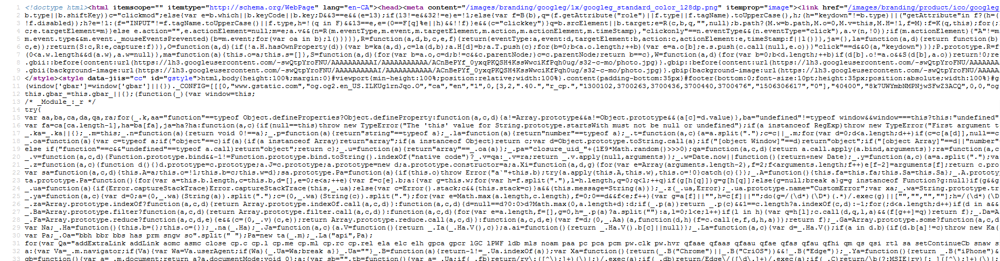

# Introduction to Web development

## Page structure

#### Table of contents

1. HTML & tags
2. Basic page structure
3. Content tags
4. Semantics & Accessibility

## 1. HTML & tags

Hypertext Markup Language (or __HTML__) is the first language we need to get acquainted with to build web pages. While the web involves a fair amount of programming, HTML isn't considered to be a proper programming language. Programming languages are __dynamic__, while HTML is __static__: it defines the structure of web pages the same way wooden frames define the walls and general layout of a house.

HTML is a language that is __interpreted__ by the browser, which can then build the __layout__ and __structure__ of whatever page you are visiting. To define layout elements, it uses __tags__ that can be combined to build complex structures. HTML tags are easily recognizable: they follow the following format: `<tag></tag>`. Standard tags are composed of an opening and a closing tag, which define the start and the end of the layout element. Some tags differ from this model and are __self-closing__, in this case, they are combined into a tag that looks like `<tag/>`. We will see examples of both of these later in this section.

Tags can have __attributes__, which define properties applies on the tag. Attributes are easily recognizable, as they follow the format `<tag attribute="value"/>`. Each tag has its own set of attributes, some of which we'll put to good use later.

### Tag closure

If a tag is not of the self-closing kind, always make sure to close it. If you do not, your browser will attempt to do it for you, which can lead to some interesting results. A good way to keep track of tag closure is to use __indentation__ and __comments__. You can add any amount of indentation to your HTML code without affecting the result seen by the user, this can be handy to help visualizing depth:

```html
<tag>
	<tag>
		<tag>
		</tag>
	</tag>
</tag>
```

Similarly, comments allow you to add notes that, just like indentation, won't affect how the web page is rendered. You can add comments by using opening and closing  markers `<!--` and `-->` as follows:

```html
<tag><!-- Opening the first tag-->
	<tag><!-- Opening the second tag -->
		<tag><!-- Opening the third tag -->
		</tag><!-- Closing the third tag -->
	</tag><!-- Closing the second tag -->
</tag><!-- Closing the first tag -->
```

## 2. Basic page structure

Page markup can get quite wordy. If you take a look at Google's home page, which looks simple on the surface, you are faced with this:



Of course, not all of this is HTML. Some of it is CSS and Javascript, two languages that we will touch a bit later when we'll talk about __styling__ and __interactivity__; the underlying HTML code is however still heavy. If we strip all the fluff away, a simple structure composed of three fundamental tags remains:

```html
<html>
	<head>
	</head>

	<body>
	</body>
</html>
```

These three tags, `<html>`, `<head>` and `<body>`, define where the page begins, where it ends, and which content is meant for the browser and which is meant for the user. The `<html>` tag define the start and end of the page so that your browser can locate itself. It also tells the browser that the document is an HTML document and should be interpreted as such. The `<head>` tag contains information that is meant for your browser and that shouldn't appear visually on the page. It's where we'll include tags that import style and interactive scripts, define meta-data unique to your site so that engines like Google, Facebook and Twitter can classify it properly, and more! Finally, the `<body>` tag defines the visible area of your page. Anything that is meant to be seen by the user should be put within the `<body>` tag.

While these tags _help_ the browser to make sense of your code, if they are absent of malformed, your page will still be displayed. Modern browsers are extremely resilient in front of mishappen pages, but older ones might not be. Moreover, different browsers might have different heuristics when it comes to repairing broken pages. For this reason, it's extremely important to ensure that your pages are structurally sound.

## 3. Content tags

Now that we have a basic page structure, we only need a way to organize our content. Here are a collection of a few content-related tags that you can include in the `<body>` tag to display text and images:

### Headings

Headings can be generated using the `<hx></hx>` tags, where `x` is replaced by a value between 1 and 6, from largest to smallest. These headings come with a surrounding margin, and stretch over a whole line:

<h1>Heading 1</h1>
<h2>Heading 2</h2>
<h3>Heading 3</h3>
<h4>Heading 4</h4>
<h5>Heading 5</h5>
<h6>Heading 6</h6>

### Text tags

There are many text-related tags in HTML, the most basic of which is the `<p></p>` tag, which defines a paragraph. Paragraphs are block text tags that serve more to structure the text than to style it. Without `<p>` tags, text will appear as a blob -- they are one of the ways by which your browser recognizes that a new line should be inserted.

Within paragraphs, the `<em></em>` and `<strong></strong>` tags allow you to define <em>italicized</em> and <strong>bolded</strong> text. These tags are pure stylistic.

You can of course combine these tags together and nest them:

```html
<p>This is meant to be a <em>very</em> important paragraph. This is why we use <strong>emphasis</strong> tags like the `<strong>` and `<em>` tags. We can even nest them together to have text that is both italicized and bolded like <em><strong>this</strong></em>.</p>
```

Which renders as:

<p>This is meant to be a <em>very</em> important paragraph. This is why we use <strong>emphasis</strong> tags like the &lt;strong&gt; and &lt;em&gt; tags. We can even nest them together to have text that is both italicized and bolded like <em><strong>this</strong></em>.</p>

You can also <ins>underline</ins> text using `<ins></ins>`, <del>cross it over</del> with `<del></del>` and <mark>highlight</mark> it using `<mark></mark>`.

### Adding images

So far, we've seen tags that have opening and closing segments, and that encapsulate content. The `` tag, which allows us to insert images into our pages, is our first taste of the self-closing tag type we've mentioned earlier. It's also our first exposition to __attributes__. The `` tag requires the `src` attribute to define where the image that we want to insert can be found.

#### Leading the way to images (and other resources)

In most cases, we will have two strategies to indicate where resources are: __URLs__ and __relative paths__.

A URL is a full website address which includes the path to a resource. For example, the logo present on Google's front page lives at `https://www.google.ca/images/branding/googlelogo/1x/googlelogo_color_272x92dp.png`. If you use this URL as a value for the `src` attribute of your image tag, you will see this:

```html

```


URLs are useful if you want to use __external resources__ that are not hosted by you. Being a link to something external, they however carry risk: if the resource pointed at by your URL changes or is removed, your page might change or might become broken.

__Relative paths__, on the other end, are meant to be paths that start from the page where they are written. Directories are represented by a `/` character such that you can access resources even if they are in a complicated folder structure.

For example, let's assume you have the following directory arrangement:

```html
/index.html
/images/
	smiley.png
	logo.jpg
	selfie.jpeg
```

Then to access `smiley.png` from your index page, you would use the relative path `images/smiley.png`. More generally, you could go deeper into directories by adding more to the path: `folder1/folder2/folder3/my_file.jpg`. Relative paths will allow you to use __internal resources__ (or self-hosted resources). These are files you control and carry little risk of changing or breaking your page.

You can use the `src` attribute with relative paths in a similar way than you did with the URLs: ``.

### Creating tables

With text and images out of the way, we can look at more complex content structures such as tables. Much like GoogleDocs or Word documents, HTML markup is well prepared to allow you to insert tables into your pages so that you can feature data in an organized way.

Tables are structured around a handful of tags, of which `<table></table>` is the root. Inside `<table>` tags, you should only find __rows__, represented by `<tr></tr>`. Deeper inside, you can then find single cells, represented either by `<th></th>` for "table headers" or `<td></td>` for normal cells.

A typical table structure would look like this:

```html
<table>
	<tr>
		<th>Column 1</th>
		<th>Column 2</th>
		<th>Column 3</th>
	</tr>

	<tr>
		<td>1</td>
		<td>2</td>
		<td>3</td>
	</tr>

	<!-- And so forth -->
</table>
```

Which is rendered into:

<table>
	<tr>
		<th>Column 1</th>
		<th>Column 2</th>
		<th>Column 3</th>
	</tr>
	<tr>
		<td>1</td>
		<td>2</td>
		<td>3</td>
	</tr>
		<tr>
		<td>4</td>
		<td>5</td>
		<td>6</td>
	</tr>
</table>

A few things to note:

- The first row usually sets the tone for the rest of the table: the number of cells on the first row will be default number of cells for the following rows;
- The `<table></table>` tag takes care of aligning and positioning content;
- If you include too many columns in a row, or have a malformed row/cell, some parts of your table might not appear on the page or might overflow the limits of the table;
- If you wish to have certain cells span multiple columns, you can use the `colspan` attribute: `<th colspan="2">` would produce a heading cell that occupies the space of two consecutive columns.

### Creating lists

Lists follow the same kind of structure as tables: they are composed of multiple tags nested into each other. HTML offers us two kinds of lists, __ordered lists__ and __unordered lists__, which only differ by the "marker" next to each element. Ordered lists will naturally have a counter, and unordered lists will have a neutral dot or other geometrical marking.

You can create a list by using the `<ol></ol>` tag (or `<ul></ul>` for an unordered list) and then adding list items to it using `<li></li>`.

```html
<ul>
	<li>List item 1</li>
	<li>List item 2</li>
	<li>List item 3</li>
</ul>
```

This renders as:
<ul>
	<li>List item 1</li>
	<li>List item 2</li>
	<li>List item 3</li>
</ul>

The ordered list is no different, by swapping the `<ul></ul>` for `<ol></ol>`, we obtain this:
<ol>
	<li>List item 1</li>
	<li>List item 2</li>
	<li>List item 3</li>
</ol>

Lists can have as many items as you need them to, but beware: __`<ul></ul>` and `<ol></ol>` tags should only contain list items!__ We'll see later that lists are especially useful as they are the conventional way to make __navigation menus__.

## 3. Semantics & Accessibility

The myriad of available HTML tags not only allow you to produce visually stunning websites, but can also help with __accessibility__. When HTML was designed, the only devices capable of accessing the web were conventional computers. With time, new actors have entered the stage, including screenreaders and others that help impaired users to navigate the Internet.

A sizeable portion of the tags that we will use to build our pages carry __meaning__ that is used by accessibility-oriented devices to interpret the message that your pages try to convey. This is why it's extremely important to avoid __malformed page structures__ where tags are at the wrong place or are missing: while browsers will make the best of it manually, it may leave visitors who can't see behind.

Accessibility aside, the semantics of the web are also important to properly assist the plethora of automated software crawling and mapping the Internet. Google, for example, employs "spiders" to explore links and build the index that is used in searches. Of course, these crawlers will not see the visual render of your pages; they will however read your code and try to make sense of it. Without proper structure, your pages might get indexed incorrectly or even ignored.

Here are a few semantic tags that you can use to organize your content further:

|Tag|Meaning|
|---|---|
|`<header></header>`|Defines the header of a page or of a section of your content.|
|`<main></main>`|Container for the main elements of your page.|
|`<footer></footer>`|Footer section of your page|
|`<section></section>`|Defines sections in a document, such as a chapter.|
|`<article></article>`|Defines a document.|
|`<aside></aside>`|Defines content that isn't central to your page's message.|

There are many more tags like these; none of which produce anything visual when your page is rendered by the browser. We'll call these __organizational tags__ (as opposed to the content tags discussed earlier).

These tags can be used to split your code into sections and make it easier for you to read and work with (and for non-graphic devices or software to parse and use).

Using these in conjunction with the content tags mentioned earlier could give a page structure like this one:

```html
<html>
	<head></head>

	<body>
		<!-- Page header -->
		<header></header>

		<!-- Page's main content -->
		<main>

			<!-- First document or independent bit of info -->
			<article>
				<!-- Part one -->
				<section></section>

				<!-- Part two -->
				<section></section>
			</article>

			<!-- Second document or independent bit of info -->
			<article>
				<!-- Part one -->
				<section></section>
				
				<!-- Unnecessary but relevant information on the topic -->
				<aside></aside>

				<!-- Part two -->
				<section></section>
			</article>
			
		</main>

		<!-- Page's footer -->
		<footer></footer>
	</body>

</html>
```

There also exist __non-semantic__ organizational tags such as `<div>`; while the `<div>` serves the same organizational purpose (i.e. allows you to group your code into blocks for easier reading), it does not carry any meaning and will not contribute to the semantic readability of your page.

