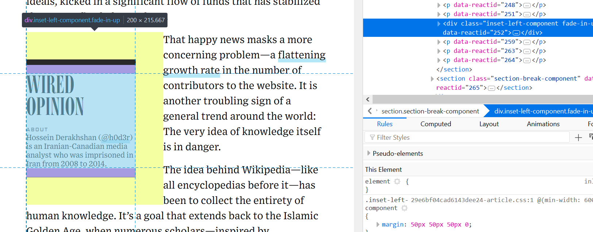
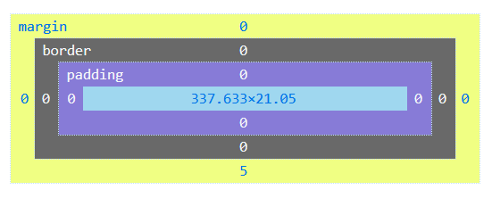

# Introduction to Web development

## Introduction to CSS

#### Table of contents

1. [Cascaded Stylesheets](#css)
- [Embedding style in pages](#embed)
- [Rule structure](#rulestructure)
- [Basic text styles](#textstyling)
- [More cascading](#morecascading)
- [Using the `<style>` tag and CSS selectors](#styletag)
- [Isolating style from structure](#stylestructure)
- [Review](#review1)
2. [Building page layouts](#layouts)
- [Organizing content into boxes](#boxes)
- [Units of measurement](#units)
- [Setting the size of elements](#sizing)
-	[Building a layout with FlexBox](#flexlayouts)
- [Spacing](#spacing)
- [Review](#review2)
3. [Advanced selectors](#adv_selectors)
- [Parent/child selection](#parchild_select)
- [Pseudoselectors](#pseudoselect)
4. [Example: menus](https://github.com/mcataford/Learning/blob/master/IntroToWeb/3.%20First%20contact%20with%20CSS/CSS_basicnavigation.md)

<a id="css"></a>
## 1. Cascaded Stylesheets

Before we start talking how we can add style to our web pages, we need to understand a bit about how our browsers use stylistic information to make the web engaging and aesthetically pleasing. It all starts by understanding what __Cascaded stylesheets__ are.

__Cascaded stylesheets__, which compress into the often used acronym __CSS__, are repositories for the markup that defines how our __structural elements__, defined by __HTML__, appear in our browsers. Much like HTML, CSS isn't programming: it is a static markup language that is interpreted as __style rules__ that are attached to elements.

Web pages can depend on many CSS files simultaneously, and a single structural element can receive its characteristics from many rules concurrently. CSS is a __cascade__ where rules are applied in layers according to a certain priority hierarchy.

<a id="embed"></a>
### Embedding style in pages

Before we see how CSS rules can be listed in external files, we will first see how we can embed them directly in our web pages. We can do so in two ways: using the `style` attribute, or the `<style>` tag.

By applying the `style` attribute on any tag, we can attach rules to that element. The rules we attach to elements this way are said to be __inline styles__ and override any other rule.

The `<style>` tag, on the other hand, allows us write our CSS as we would in a CSS file: as one block where rules are defined sequentially. When a `<style>` block exists in a page, the rules it contains are applied as soon as the browser reads that part of the page's code. This means that it is preferrable to put `<style>` tags in the `<head>` portion of our page, as it is the portion that is read first. 

Until we talk about how we can target elements of a page, we will use the __inline styles__ method.

<a id="rulestructure"></a>
### Rule structure

Rules have a very simple structure that applies no matter where the rule is stored:

```css
css-property: value;
```

Rules are composed of two elements:
- A __property__ that is the aspect that we are styling;
- A __value__ that defines how the __property__ is affected.

Each property has a set of valid values, and any __invalid values__ will be ignored by the browser. Moreover, as we'll see later, not all properties are supported by all browsers! For this reason, we will focus on generally supported properties and will make sure to make note of which ones lack support.

Also note the syntactic sugar: a __colon__ is always present between a property and its value, and each rule is ended by a __semicolon__. Forgetting any of these may cause the browser to ignroe the faulty rule __and the ones that follow__.

<a id="textstyling"></a>
### Basic text styles

Now that we know about the `style` attribute, we can dabble with basic CSS rules and experiment. A good entry point is, just like with structural tags, text content.

Here are some basic properties we will play with:

|Properties|Meaning|Example values|
|---|---|---|
|`color`|Changes the color of text.|[Hex colours](), [some colour nouns](), etc.|
|`font-size`|Changes the size of the text.|A measure in pixels (`px`), in `em`/`rem`, etc.|
|`line-height`|Changes the spacing between lines.||
|`font-weight`|Changes how bold the font is.|`normal`, `bold`, etc.|

You can attach any of these properties (and any other) on a structural tag using the `style` attribute:

```html
<p>The sky is <em style="color: blue;">blue</em>, the grass is <strong style="color: green;">green</strong></p>
```
Which is interpreted by the browser as:
<p>The sky is <em style="color: blue;">blue</em>, the grass is <strong style="color: green;">green</strong></p>

#### Try it out

Create a small page in which you have multiple copies of the same paragraph tag (and its content) and apply varying values of any of the properties above. Some properties, like `font-size`, accept numerical values; try tweaking them to gauge the effect of change on those properties.

<a id="morecascading"></a>
### More cascading

The notion of a stylistic cascade mentioned earlier also has a very important implication: __style applied to a parent is also applied to any and all of its children__.

This means that we can attach a rule to a tag to automatically attach it to all the tags that are placed inside of it without having to write it again. This also complicates knowing where style comes from as pages get more and more complex.

If we take back the last snippet, we could make the whole text, inner tags included, bigger by playing with `font-size` if we apply it on the `<p>` tag:

```html
<p style="font-size: 18px;">The sky is <em style="color: blue;">blue</em>, the grass is <strong style="color: green;">green</strong></p>
```
Which is interpreted by the browser as:
<p style="font-size: 18px;">The sky is <em style="color: blue;">blue</em>, the grass is <strong style="color: green;">green</strong></p>

This is a useful feature of CSS: if we have general stylistic elements that we would like to apply on a whole page, we could simply target the `<body>` tag, which has every other tag as a descendent. This is especially useful to set a default text size for an entire page.

#### Try it out

Build a small HTML snippet composed of a paragraph or two which themselves contain other tags that will bold or italicize some parts of their content. Apply a certain rule to the _parent_ tag, and apply a different version of that same rule (same property, different value) to the _children_ tags. Which version wins?

<a id="styletag"></a>
### Using the `<style>` tag

Now that we have a general understanding of how the `style` attribute can be used to include style directly in our tags, it's time to see how we can use the `<style>` tag instead to produce cleaner HTML files.

As we said earlier, the `<style>` tag should be included in our pages' `<head>` so that it is seen by the browser as soon as possible. Within the `<style>` tag, we will list our rules so that they can be applied the same way they were in our __inline style__.

Before we can do that, however, we need a way to target elements. When we included inline style in the tags, the style was directly on the element on which it applied. When we use the `<style>` tag, our rules will be _separated_ from the tags, requiring us to specify where those rules should go.

To link structural and stylistic elements, we will use the `id` and `class` attributes. Those attributes will allow us to give unique or collective names to our tags so that our CSS markup can target them and apply our style directives at the right place.

Within the `<style>` tags, CSS rules are organized a bit differently than in the `style` attribute; rules will be gathered into blocks assembled under a __selector__ that targets one or more structural elements.

```css
selector {
	property: value;
}
```

The `selector` can be an `id` or `class` (or more, as we'll see later), and the `property`/`value` couples are the same as they would be in the inline style.

#### The `id` attribute

The `id` attribute allows you to give a unique identifier to your structural elements so that you can refer to them in CSS. Note that once you give an `id` to an element, __you shouldn't give the same `id` value to another element in the same page__!

You can add the `id` attribute to an element by adding `id="my_id"` to its tag:

```html
<p id="first_paragraph">My text.</p>
```

Once added to an element, the `id` value can be used as a selector by __prepending a hashtag to it__. If we wanted to change the colour of the `<p>` tag we just defined, we would write:

```html
<style>
#first_paragraph {
	color: blue;
}
</style>
```

#### The `class` attribute

The `class` attribute works the same way the `id` does, but isn't unique. It allows you to define style for a range of elements related to each other somehow. You can attach a class (or multiple) to an element by filling the `class` attribute. Once defined, you can refer to it in CSS by __prepending a period to the `class` value__.

```html
<p class="important">This is an important paragraph.</p>

<style>
	.important {
		font-weight: bold;
	}
</style>
```

#### Using a tag name as selector

You can also select all the tags of a specific type by using the tag name as a selector. For example, you could use `p` as a selector to select and apply style to all `<p>` tags, regardless of the `id` or `class` values attached to them.

#### Parent/children

One last basic feature of selectors that is tremendously helpful is the ability to target tags by specifying their parent. Let's consider the example markup below:

```html
<p>My text is <strong>important</strong></p>
<strong>This one is a bit less important.</strong>
```

How could we target the `<strong>` tag that is __inside__ of the `<p>` tag without targetting the one that is also outside?

Based on our previous discussion of `id` and `class` attributes, it's evident that we could add an id or a class to the tag(s) we want to target. It is however good practice to keep markup as simple as possible: if we can avoid adding attributes and rules, we should. This leads to more concise code that is easier to read and troubleshoot.

To reduce the number of `id` and `class` attributes floating around, we can refer to the tags themselves by defining not only the tag we want to apply the rules on, but also its parent(s):

```
p strong {
	color: red;
}
```

In the case above, `color: red;` only applies to `<strong>` tags that are within a `<p>` tag. You can add as many ancestors as you want to target elements more precisely (eg. `p em strong` would target `<strong>` tags that are contained in an `<em>`, itself contained in a `<p>`).

<a id="stylestructure"></a>
### Isolating style and structure

When we discussed the `style` attribute and the `<style>` tag, we mentioned that the main motivation to remove stylistic elements from the tags themselves is to keep our code clean and minimal. Our objective in doing this is also to isolate __style__ from __structure__ so that we can use the same stylistic rules across multiple pages.

Sharing stylesheets will make it possible to effortlessly expand our websites to multiple pages while keeping a common stylistic thread (and without having to duplicate our CSS markup from page to page).

Anything that is put inside of `<style>` tags can be directly moved to a `.css` file, which we can then link to our page. To make that linkage possible, we will use the `<link>` tag. Since it's meant to be viewed by our browser but not by our visitors, this tag belongs to the `<head>`.

The `<link>` tag possesses two essential attributes: `href` and `rel`. 

`href` works exactly the same way it did with the `<a>` tag or with the `` tag's `src` attribute: it accepts a __relative path__ or __URL__.

`rel` defines what is the __relationship__ between the tag's linked resource and the page. When linking to stylesheets, we'll give `rel` the value of `stylesheet`.

```html
<link href="path/to/stylesheet.css" rel="stylesheet"/>
```

The `<link>` tag should replace all `<style>` tags in your pages; this way, all style is easy to share and distribute. Moreover, separating style from structure allows you to edit style without touching the structure at all, therefore reducing the scope of what you work on.

<a id="review1"></a>
### Review

- You can add __style__ to your tags by using __inline style__ (through the `style` attribute) or __style blocks__ (through the `<style>` tag).
- Style is conveyed by using __CSS rules__ that have the format `property: value;`.
- Each property has a set of valid values; invalid values are ignored by browsers.
- If you use inline style, your rules are directly attached to the structural elements.
- If you use `<style>` tags, you need to use __selectors__.
- The selectors are used to form __style blocks__:
```css
selector {
	property: value;
}
```
- Selectors can be `id` or `class` attributes, or the tag name itself.
- To use `id` values as selectors, prepend a hashtag in front of it (`#my_id`).
- To use `class` values as selectors, prepend a period in front of it (`.my_class`).
- To use tag names, simply use the tag name (`p` to select all `<p>` tags).
- You can select elements that possess a certain parentage by listing elements one after the other (`p strong` would target all `<strong>` tags inside of `<p>` tags).
- You can move the contents of any `<style>` tag into `.css` files and link them using `<link>` tag.

<a id="layouts"></a>
## 2. Building page layouts

Using CSS properties, we can build __page layouts__ that will allow us to feature our content differently than in one big "top-to-bottom" page. In the last section, we mentioned the `<table>` tag; before CSS gave developers proper tools to build layouts, they were quite popular to build complex page structures. Because of the "columns and rows" system already in place in `<table>` elements, they were perfect for the job.

Since then, new tools have been introduced, such as the `float` property, which allows us to put elements next to each other (thus creating columns without the restriction put forth by tables), and more recently, the `flexbox` system, which solves most if not all of the layout problems developers are usually facing.

<a id="boxes"></a>
### Organizing content into boxes

Before we can lay the foundations of our pages, we need to separate content into __boxes__ that we can move around, align and order relative to one another. Earlier, we mentioned that the `<div>` tag was designed as a __plain, non-semantic container__ that we could use to accomplish this. We also mentioned semantic blocks like `<header>` and `<section>`, which we can use in a similar manner when it is appropriate to add meaning to our page structure.

Generally speaking, pages are set up using a __box model__. This model defines each tag as a "box" that can contain text, images, or other boxes; each box then has a parent-child relationship with anything inside of itself, and a child-parent relationship with the tag that contains it.



If you use the __code inspector__ in any browser, you can get a firsthand view of the box model in action: no matter the tag on which you hover in the inspector's window, you can see an overlay on the actual rendered page showing you the boundaries of the box model of this element. As we'll see later, all boxes occupy a certain amount of space on the page, and that's what we'll use to determine what fits next to each other, and what occupies its own row.

<a id="sizing"></a>
### Setting the size of elements

The size of any element can be modified using the `width` and `height` properties. By default, elements tend to occupy as much width as they are allowed, but their height is entirely dependent on their content.

As such, an empty `<div>` would occupy the full width of its container, but its initial `height` value would be `0px` since no content is present to stretch it. We can of course modify this by explicitly setting the `width` and `height` properties in CSS:

```css
div {
	width: 500px;
	height: 200px;
}
```

<a id="units"></a>
### Units of measurement

To specify the size of elements on our page, we'll of course need some measurement units. We've already mentioned `px`, which represents one pixel of your screen, but there is a handful of them that we can use:

|Unit|Meaning|
|---|---|
|`px`|Pixels|
|`%`|Percentage of the container's value|
|`em`|The base font size of text in the element|
|`rem`|The base font size of the document|
|`vw`|Fraction of the width of the browser window|
|`vh`|Fraction of the height of the browser window|

Generally speaking, the most convenient units for the size of boxes are `%`, `vw` and `vh`. For now, we will focus on `%`.

<a id="flexlayouts"></a>
### Building a layout with FlexBox

`flexbox` (or `flex`) is the main system we'll use to build our page layouts. It is widely supported by mainstream browsers and usually offers the best results in terms of simplicity and flexibility.

`flex` mainly looks at the relationship between a parent and its children, let's consider the simple structure below.

```html
<main id="page_content">
	<section><!-- First section --></section>
	<section><!-- Second section --></section>
	<section><!-- Third section --></section>
</main>
```

Now, to use `flex`, we need to set the `display` property on the parent to `flex`:

```css
#page_content {
	display: flex;
}
```

Once that is done, a myriad of other properties can be set on both the parent and the children to modify how they appear on the page:

|Property|Applies to|Meaning|
|---|---|---|
|`justify-content`|Parent|Defines the alignment of items along the __main axis__.|
|`align-content`|Parent|Defines the alignment of items along the __secondary axis__.|
|`flex-direction`|Parent|Sets the direction in which children should expand (i.e. horizontally or vertically)|
|`flex-wrap`|Parent|Defines how the content wraps around if there isn't enough space along the main axis for everything|
|`order`|Child|Defines priority of appearance of elements|
|`flex`|Child|Defines if elements grow or shrink, and what their default size if (in three parts)|

Using these properties and by nesting elements on which `flex` is applied, we can build complex structures which we can then populate with our content.

You can find further reading on `flex` [here](https://css-tricks.com/snippets/css/a-guide-to-flexbox/).

<a id="spacing"></a>
### Spacing

__Spacing__ can also be applied on elements to separate them from each other; the `margin` and `padding` property can be set the same way as the `width` and `height` in order to specify how much space is added around and inside elements.



`padding` adjusts spacing that is __inside__ the element. It __expands__ the boundaries of the element.

`margin` adjusts the space __outside__ the element. Any element surrounding the one that has margin will be pushed away.

Finally, `border` can add visible borders around elements and also contributes to the size of the element.

It is customary to use `em`, `rem` or `px` for spacing rules since they tend to be rather small as opposed to block sizes, which are much larger.

<a id="review2"></a>
### Review

- Building page layouts requires the use of __boxes__ in which we place our content.
- HTML tags like `<div>` can help us boxing up our content and creating a wireframe we can work with, but we can also use __semantic__ tags like `<header>`, `<section>` and `<main>` to build layouts that have __meaning__.
- We can set the size of elements using the `width` and `height` property; the former is initially as large as possible given the element's parent, and the latter, 0.
- Many units of measurement can be used to define sizes: `px`, `em` and `rem` define sizes appropriate for minute details or text whereas `%`, `vw` and `vh` define much larger spans and are useful when setting up large blocks.
- __Flexbox__ is the main system we will use to set up our layouts; it relies on parent-children relationships and can be enabled for a container by using the `display: flex;` CSS rule on it.
- A certain number of rules can apply on the `flex` parent and its children, these rules define how elements are align with respect with each other, how much space they occupy and how they react if the container can't accomodate everything as intended (wrapping).
- __Spacing__ can also be used to modify the space occupied by elements; `margin` can add space __outside__ elements, `padding` can add space __inside__ and `border` can add a visible lining to our elements, also making their footprint a bit bigger.

<a id="adv_selectors"></a>
## 3. Advanced selectors

Earlier, we mentioned that we can use the `id` and `class` attributes as well as the tag names themselves to select elements on pages. There exist other selectors that can be used to target elements by using their relative position in the page's markup and similar information. While these selectors might seem to be needlessly complicating things, they actually serve a good purpose: they help coders avoid creating too many classes and ids, which are then hard to keep track of.

<a id="parchild_select"></a>
### Parent/children selection

You can exploit the parent/child relationship existing between tags in selectors. As we mentioned in our introductory talk about HTML, each tag is either contained within another, contains other tags, or both. In this context, we call any container a __parent__ and any content, __child__. These identifiers are relative to your reference point. For example, consider the following markup segment:

```html
<div>
	<p>
		My text is <strong>great<strong>.
	</p>
</div>
```

In this snippet, we can define a few parent/children relationships:

- `<div>` is the parent of `<p>` and the ancestor of `<strong>`;
- `<p>` is the child of `<div>` and the parent of `<strong>`;
- `<strong>` is the child of `<p>` and the descendant of `<div>`.

Using these relationships and the "parent/child operator" `>`, we can write more complex selectors like the following:

- `div > p` : All the `<p>` tags that are children of `<div>` tags;
- `div > p > strong` : All the `<strong>` tags that are children of `<p>` tags, which are themselves children of `<div>` tags.

This allows for more specific selectors to be used, leaving classes, ids and tag names to be general selectors that define broad rules about their related elements.

<a id="pseudo_select"></a>
### Pseudoselectors

CSS also allows a large amount of __pseudoselectors__ which can target elements based on where they are located in their parent, in the page, whether they are hovered on, or whether certain rules apply to them. A thorough account of which pseudoselectors are allowed can be found [here](https://css-tricks.com/pseudo-class-selectors/).

|Pseudoselector|Effect|Example|
|---|---|---|
|`:not(x)`|Any item that __does not__ satisfy `x`".|`p:not(.my_class)`|
|`:empty`|Any tag that is empty.|`p:empty`|
|`:first-child`|Any tag that is the first child of its parent.|`p:first-child`|
|`:last-child`|Any tag that is the last child of its parent.|`p:last-child`|
|`:only-child`|Any tag that is the only child of its parent.|`p:only-child`|
|`:hover`|Applies if the tag is hovered on by a cursor.|`p:hover`|
|`::first-letter`|Applies to text elements, style is applied to the first letter of the text.|`p::first-letter`|
|`::first-line`|Applies to text elements, style is applied on the first line of text.|`p::first-line`|

Any of these pseudoselectors can be appended to other selectors; note that `:` and `::` needs to separate the pseudoselectors and the selectors themselves.