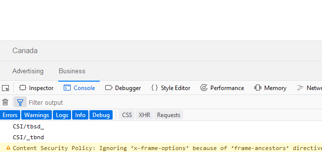

# Introduction to Web development

## Javascript

So far, we have been discussed __static__ elements. __HTML__ and __CSS__ allow for very little interactivity (past the pseudoselectors such as `:hover` and basic `keyframes` in CSS, of course). This is because HTML and CSS code is interpreted by the browser and used to generate the page you see, but it isn't actively being reinterpreted or executed. To add interactivity to our web pages, we will need to look at code that can __run__ independently of the page: enter __Javascript__.

Javascript is a simple programming language that __runs in the browser__ (and outside, if you use frameworks like [NodeJS](https://nodejs.org/en/)). As such, it is in perfect position for interactivity: since it is a proper programming language, it can listen to input and produce output; look for user actions and produce results.

#### Table of contents

1. [Basic Javascript](#js)
- [Including scripts in webpages](#js_embed)
- [Producing output in the console](#js_console)
- [Variables and operations](#js_vars_ops)
- [Basic page modification](#js_pageedit)

<a id="js"></a>
## 1. Basic Javascript

In the first part of this section, we will look at basic Javascript concepts. Since Javascript is a proper programming language, we need to understand its syntax in order to make __scripts__ that will produce the output we desire.

<a id="js_embed"></a>
### Including scripts in webpages

Before we can play with Javascript, we need a way of including Javascript code on our pages. Much like how we embedded CSS using the `<style>` tag, Javascript can be embedded in any HTML page using a special tag: `<script>`. The `<script>` tag can be used to insert a snippet of code in our pages which will be executed __when the page loads__.

In any page, you can either use the `<script>` tags to contain Javascript code, or you can use the tag's `src` attribute to specify a path to a file you'd like to include in your page. The paths leading to files in `<script>` tags will use the same convention as the ones in the `<link>` tag's `href`:

```html
<html>
	<head>
		<!-- Embed a block of JS -->
		<script>
			//Code ...
		</script>

		<!-- Include a file containing JS -->
		<script src="path/to/file.js"></script>
	</head>

	<!-- Rest of page -->
</html>
```

For clarity, we will assume that all the code mentioned here is already included in a page so that we can focus on Javascript syntax.

<a id="js_console"></a>
### Producing output in the console

Until we produce code that can interact with our page, we will also need a way of producing an output we can inspect visually. This is where the __code inspector__ feature of your browser comes in.

Any browser's code inspector contains a __Console__ or __Web console__ tab that allows you to see the output of the Javascript code running on your page. In Firefox, this tab is visible next to the __Inspector__ tab we've used previously to look at how pages were structured:



To produce output in this tab, we will use the `console.log()` function. We will discuss it at length later, but `console.log` will output its results directly to the console tab of your browser; for example, `console.log(6)` would output the value `6` to the console tab. 

<a id="js_vars_ops"></a>
### Variables and operations

The primary function of a programming language is to allow us to manipulate data. To manipulate data, we need to store it somewhere; __variables__ will allow us to do this. Javascript variables will allow you to __store__ any element of data and label it so that you can use it later.

For now, we will distinguish two kinds of data: numerical data and strings.

__Numerical data__ represents any number, integral or not, and is written out directly: `1`, `10.1`, `-56.32`. On them, we can apply any mathematical operation.

__Strings__, on the other end, can be any collection of characters enclosed by single or double quotes. For example, `"Hello, World" and 'Hi!'` are both strings.

Either of these are can be stored in a variable. To do so, you can use the `var` keyword:

```javascript
var my_variable = 1821;
var my_name = "Marc";
```

Notice a few things:

- The `var` keyword announces that we are creating a __variable__ with the name `my_variable`. A variable can only be created __once__!
- The operator `=`, called the __assignment operator__, allows us to assign a value to a variable.
- Any Javascript statement can be ended by an optional semi-colon for clarity.

Once a variable is created, you can use it by referring to its name. Depending on which type of data you are storing, usual operators such as `+`, `-`, `*` and `/` apply:

```javascript
var first = 1;
var second = 2;
var third = 10;

//Adds all three variables' values
var sum = first + second + third; 

//Divides the third by the second
var quotient = third / second;

//Subtracts the first from the second
var diff = second - first;

//Multiplies the first by the second
var product = first * second;
```

Basic arithmetic will apply to any numerical value stored in a variable, and precision will adjust automatically: an expression such as `10 / 2` will produce an integer, while `10 / 3` will produce a floating point value without needing you to intervene.

While most operations are not defined for strings, `+` can be used to __concatenate__ strings together; combining smaller strings (or strings and numerical values) into longer strings:

```javascript
var my_name = "Marc";
var my_age = 27;
var my_sentence = "My name is " + my_name + " and I am " + my_age + ".";
```

<hr>

#### Try it out!

Build a small webpage stub containing a `<script>` tag which links to an external JS file; in this file, declare a handful of variables and play with `console.log()` to print the results of operations in the console. __Make sure that you can use your browser to inspect and see the output of your Javascript code!__

<hr>

<a id="js_pageedit"></a>
### Basic page modification

To make our variable manipulations, happening behind the scenes, truly interesting, we need a way to connect our Javascript code to the visual representation of the page so that the output of our programs is no longer tucked away in the code inspector.

In the interest of simplicity, we will use jQuery to manipulate our page; jQuery is a Javascript framework that simplifies interactions between our code and what appears on the page. In be able to use it, we need to add a `<script>` tag that includes it at the top of our page, before any scripts that would use jQuery to manipulate the page:

```html
<script src="https://code.jquery.com/jquery-3.2.1.min.js" integrity="sha256-hwg4gsxgFZhOsEEamdOYGBf13FyQuiTwlAQgxVSNgt4=" crossorigin="anonymous"></script>
```

This tag gets the jQuery library from a _content distribution network__, which we discussed in the very first lesson. Once included in your page, you can use any of [jQuery's functions](http://api.jquery.com/).

In our case, we will start off by manipulating the page, and before we can do so, we need to __access__ page elements. The jQuery convention to do so is as follows:

```javascript
$(css selector)
```

Here, `css selector` can be replaced by any __string__ containing a CSS select just like the selectors we used in our stylesheets!

For example, given the following elements:

```html
<div class="my_block">
	<p id="first_paragraph">Hello, world!</p>
	<p id="second_paragraph">Much less important text! :(</p>
</div>
```

We can select the `<div>` element by using `$(".my_block")`, the first paragraph with `$("#first_paragraph")` and all `<p>` tags with `$("p")`.

Once selected, you can directly edit these elements on the page using the following functions:

|Function|Effect|Example|
|---|---|---|
|`.text(str)`|Replaces the __text__ inside a tag.|`$("#first_paragraph").text("Text!");`|
|`.html(str)`|Replaces the __html__ inside a tag, allowing you to insert more tags inside.|`$(".my_block").html("<h1>Hey!</h1>");`|
|`.append(str|element)`|Adds the text/html or jQuery element at the end of the specified tag.|`$(".my_block").append("<h1>Hey!</h1>");`|
|`.prepend(str|element)`|Adds the text/html or jQuery element at the beginning of the specified tag.|`$(".my_block").append("<h1>Hey!</h1>");`|
|`.remove()`|Removes the element from the page.|`$("#second_paragraph").remove()`|

More of these functions exist and can be found in the reference material linked earlier; however, these are the ones we will use the most in our practice.

Additionally, you can __create__ new tags and insert them on your page using the `append` and `prepend` functions above by __storing a jQuery selection statement in a variable__:

```javascript
//This tag only exists in our variable, but not yet on the page!
var my_new_tag = $("<h1>");

//This adds the new tag to the page by appending it to the <body> tag.
$("body").append(my_new_tag);
```

<hr>

#### Try it out!

Using the __Web console__ of your browser (accessed through the _Inspect element_ menu), let's manipulate [Google](http://www.google.ca)'s home page.

- The Google logo has __id__ `hplogo`, can you use jQuery to remove it from the page?
- Can you add a a sentence anywhere on the page while preserving the content that is already there?
- Can you replace all the page's content by a __heading tag__ of your choice (use the `.html()` function)?
- Try adding a tag using `.text()`, what happens then?
- Can you use the console to create a tag (hint: read the last part of the last section about creating new tags inside variables) and insert it in the page?

</hr>
